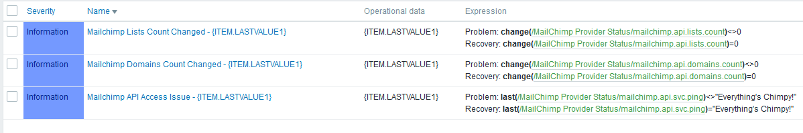
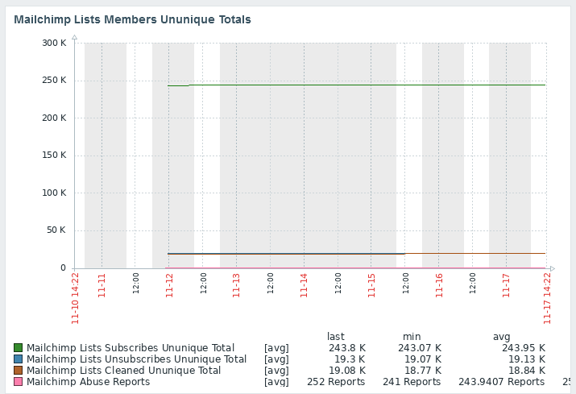
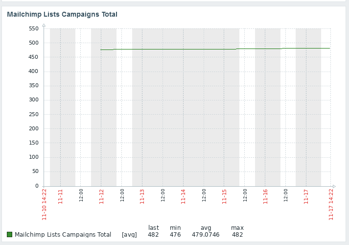
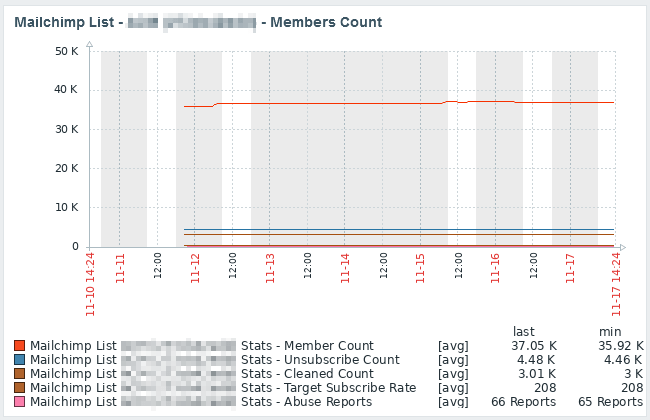
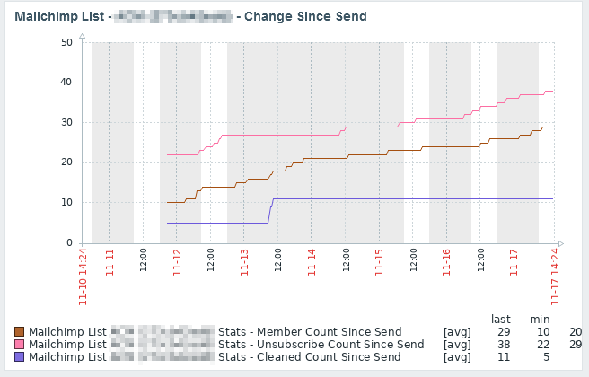
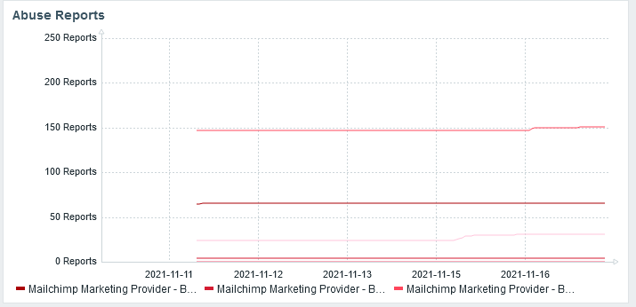
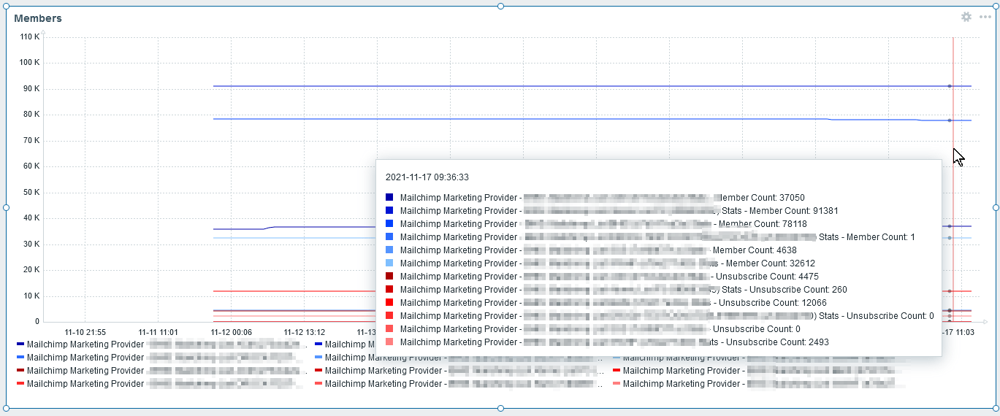

# Zabbix_MailChimpStats
Zabbix MailChimp Account Status Template using Mailchimp API v3 and Zabbix LLD discovery

# Installation
- Import template
- Create host, add agent interface
- Assign template
- Set inherited macros (API Key, Mailchimp DC Server)

# Features
- Gets all domains
- Gets all lists, counts member statuses of lists, subscribe/unsubscribe metrics, abuse-reports
- Gets all lists'campaignss, counts emails sent
- Trigger on non-auth domains
- Trigger on invalid API auth
- 12 root items

# LLD Discovery
- Domains (4 items per domain, 2 triggers)
- Lists (28 items per list, 7 graphs)

# Screenshots

Basic Triggers

Dashboard - Main Information - Unique Totals (7 days)

 
Dashboard - Main Information - Campaign Totals (7 days)

Dashboard - Detail Information - Campaign Members Protoype (7 days)

Dashboard - Detail Information - Campaign Change Since Last Send (7 days)

Custom Dashboard (not in template) - Abuse Complaints

Custom Dashboard (not template) - Members

# Updates

## November 17 2021
- Added screenshots

# Known Issues
- Does not capture transactional email information
